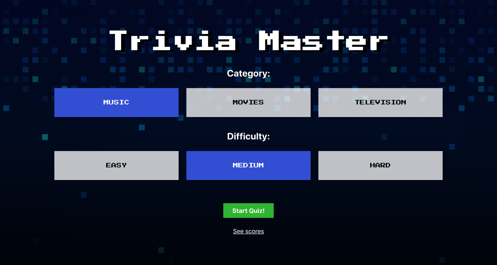

# Trivia Master

Trivia Master is a quiz application that allows the user to choose from three categories and difficulty levels and take a fifteen-question multiple choice quiz. The user will have ten seconds to answer each question and will receive unique questions for each quiz attempt until all available questions are from The Open Trivia Database are used, at which point a new token will be provided. The user can save and delete quiz scores using local storage.

**Deployed Application:** (https://rademakerjohn1.github.io/trivia-master/)





## Getting Started

These instructions will get you a copy of the project up and running on your local machine for development and testing purposes.

### Prerequisites

Please ensure all of the following prerequisites are installed on your local development machine:

* Git - [Download & Install Git](https://git-scm.com/downloads). OSX and Linux machines typically have this already installed.

### Download

There are two ways you can get the code:

### Cloning The GitHub Repository
The recommended way to get Trivia Master is to use git to directly clone the Trivia Master repository:

```bash
$ git clone https://github.com/rademakerjohn1/trivia-master.git
trivia-master
```

This will clone the latest version of the Trivia Master repository to a **trivia-master** folder.

### Downloading The Repository Zip File
Another way to use the Trivia Master code is to download a zip copy from the [master branch on GitHub](https://github.com/rademakerjohn1/trivia-master/archive/master.zip). You can also do this using the `wget` command:

```bash
$ wget https://github.com/rademakerjohn1/trivia-master/archive/master.zip -O trivia-master.zip; unzip trivia-master.zip; rm trivia-master.zip
```

Don't forget to rename after your project name.

### Install

Once you've downloaded and installed prerequisites, you're ready to begin install process. 

The project comes pre-bundled with a `package.json`file that contains the list of modules you'll need to run the application.

To install dependencies, run this in the application folder from the command-line:

```bash
$ npm install
```
This command does a few things:
* First it will install the dependencies needed for the application to run.
* If you're running in a development environment, it will then also install development dependencies needed for testing and running your application.
* To update these packages later on, just run `npm update`

## Running The Application

Run the application using npm:

```bash
$ npm run start
```

Your application should run client-side on port 3000 with the *development* environment configuration, so in your browser just go to [http://localhost:3000](http://localhost:3000)

## Running the tests

```bash
$ npm test
```

## Built With

* [React](https://reactjs.org/) - Client-side javascript library for building user interfaces
* [Open Trivia Database](https://opentdb.com/) - 3rd-party API for retrieving trivia questions

## Built By

* John Rademaker

## License

This project is licensed under the MIT License - see the [LICENSE.md](LICENSE.md) file for details